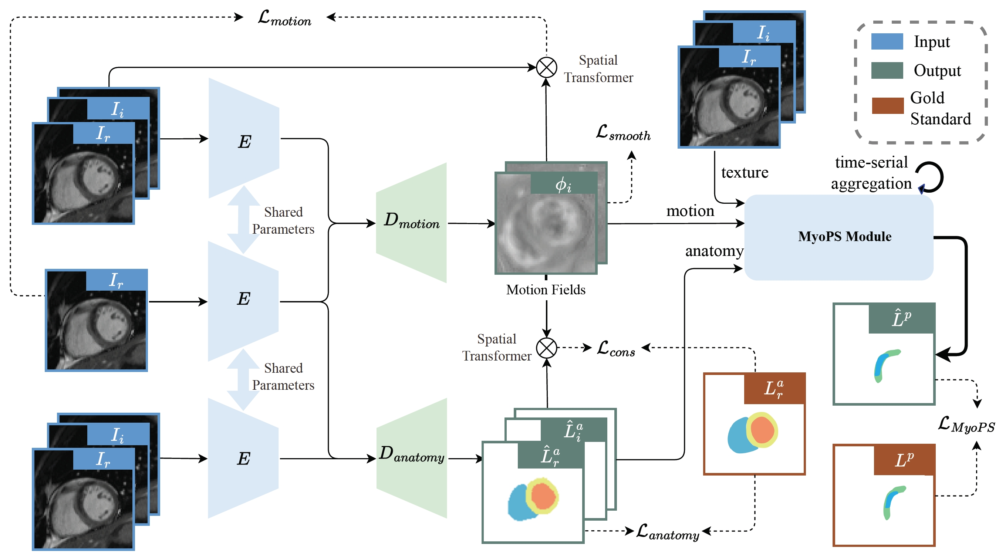

# CineMyoPS: Myocardial Pathology Segmentation Network for Cine CMR Images
Myocardial infarction (MI) is a leading cause of death worldwide. Late gadolinium enhancement (LGE) and T2-weighted cardiac magnetic resonance (CMR) imaging can respectively identify scarring and edema areas, both of which are essential for MI risk stratification and prognosis assessment. Although combining complementary information from multi-sequence CMR is useful, acquiring these sequences can be time-consuming and prohibitive, e.g., due to the administration of contrast agents. Cine CMR is a rapid and contrast-free imaging technique that can visualize both motion and structural abnormalities of the myocardium induced by acute MI. Therefore, we present a new end-to-end deep neural network, referred to as CineMyoPS, to segment myocardial pathologies, \ie scars and edema,  solely from cine CMR images. Specifically, CineMyoPS extracts both motion and anatomy features associated with MI. Given the interdependence between these features, we design a consistency loss (resembling the co-training strategy) to facilitate their joint learning. Furthermore, we propose a time-series aggregation strategy to integrate MI-related features across the cardiac cycle, thereby enhancing segmentation accuracy for myocardial pathologies. Experimental results on a multi-center dataset demonstrate that CineMyoPS achieves promising performance in myocardial pathology segmentation, motion estimation, and anatomy segmentation. 


####  Architecture

The network architecture of CineMyoPS is shown as follows:




####  Model Setup
- download our trained model from [baidu yun](https://pan.baidu.com/s/1ijuQaR0Ix6CE2Nu-TxareA?pwd=jrey)
- put them into ./outputs/nnunet/output/nnUNet/3d_fullres/Task025_Cine_Seg/TrainerV6WithoutIMG__nnUNetPlansv2.1/all

#### Usage Instructions

```bash
cd ./code

# Training Command
python ./Lascar_3_train.py 3d_fullres TrainerV6WithoutIMG Task025_Cine_Seg all

# Testing Command
python ./Lascar_4_test.py -tr TrainerV6WithoutIMG -i <your_input_path> -o <your_output_path> -t 025 --chk model_best --overwrite_existing --fold all
```

# Thanks
CineMyoPS is implemented based on [nnUNet](https://github.com/MIC-DKFZ/nnUNet) framework.
